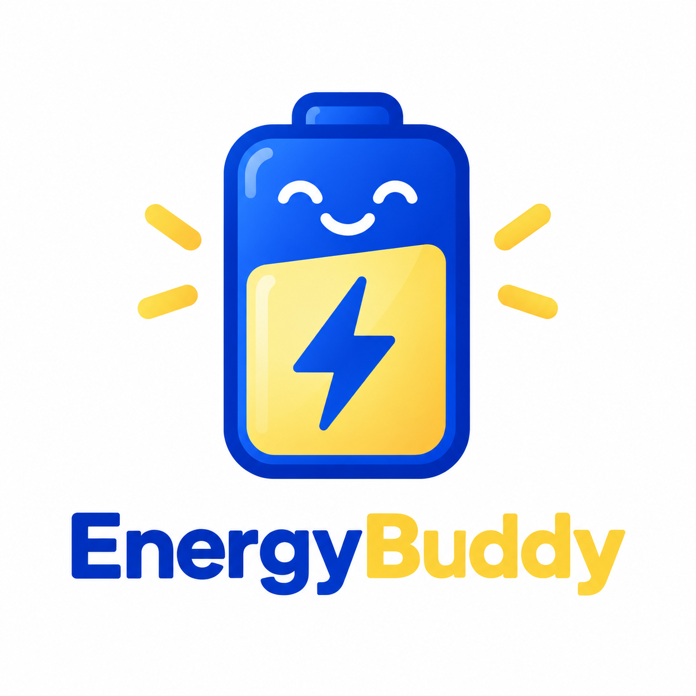
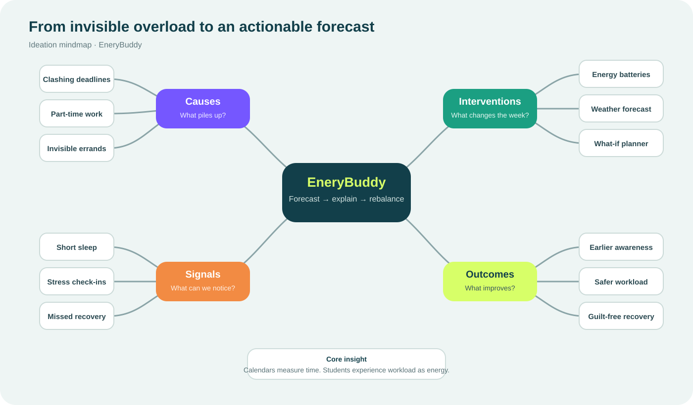
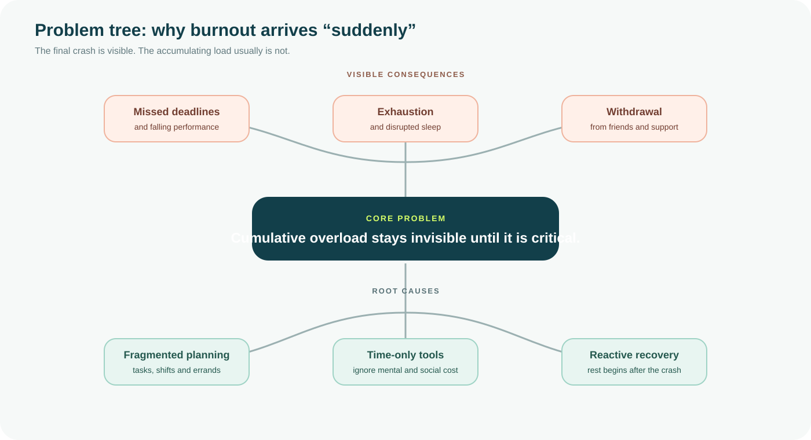
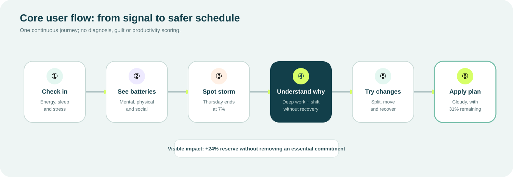
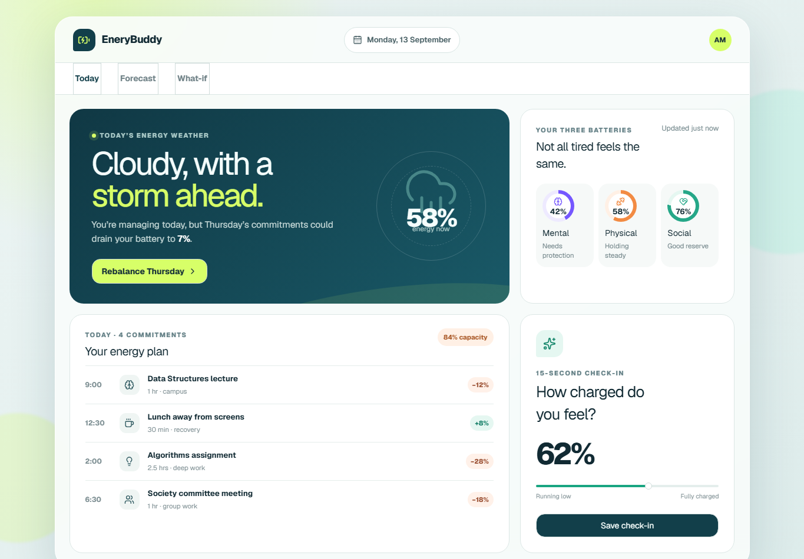
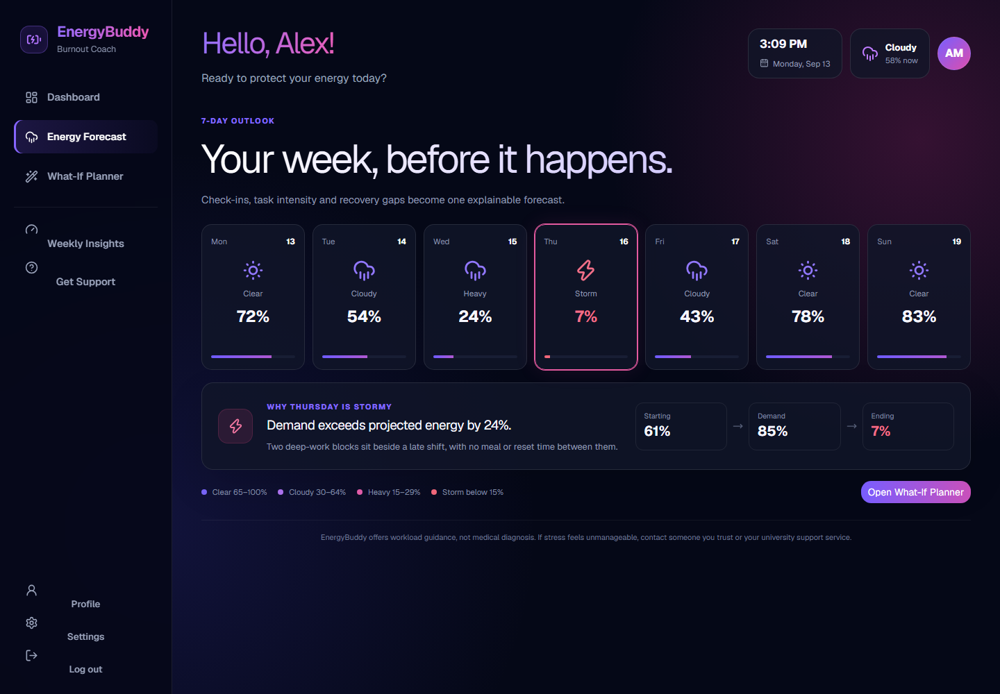
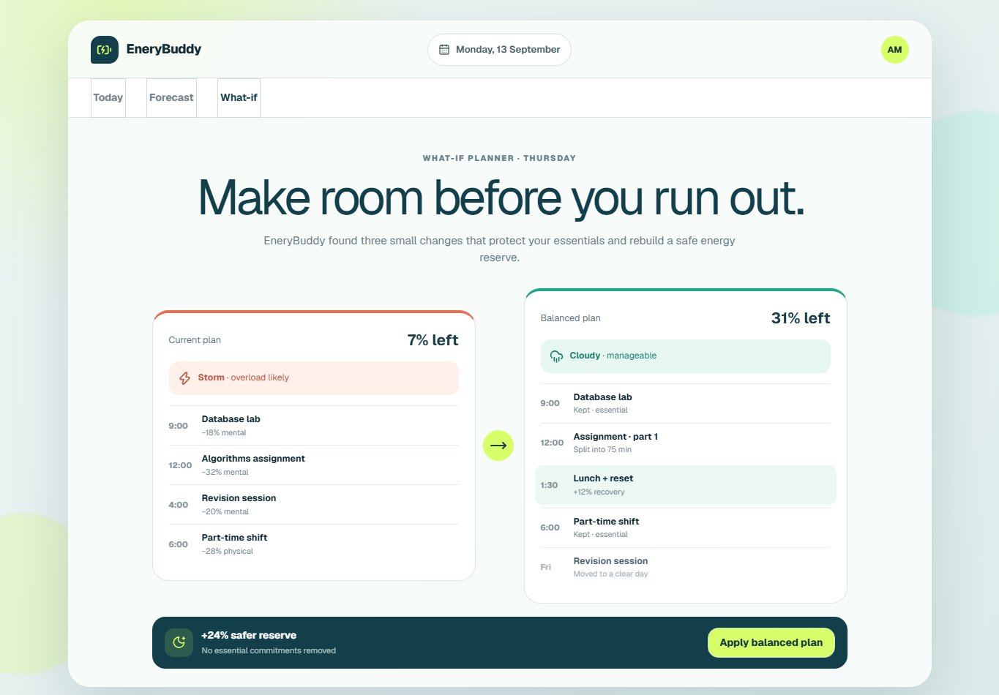
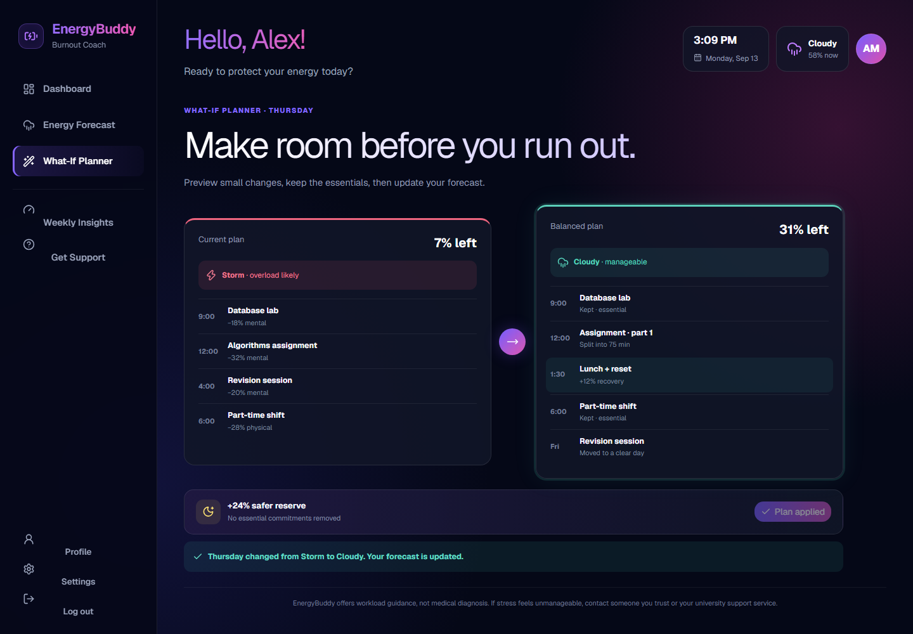
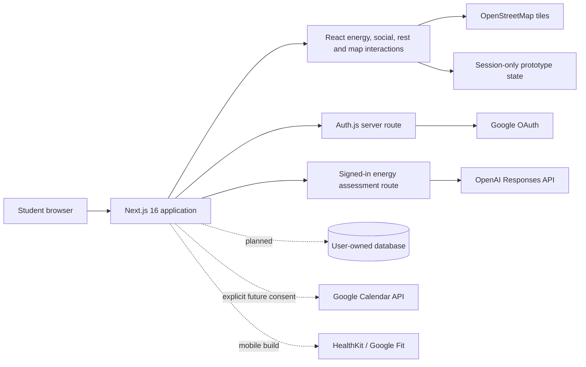

<p align="center">
  
</p>

<h1 align="center">EnergyBuddy</h1>

<p align="center"><strong>Know your energy. Predict the storm. Prevent burnout.</strong></p>

<p align="center">
  <a href="https://energybuddy.vercel.app"><strong>Open the live prototype</strong></a>
  ·
  <a href="https://github.com/MantouOP/EnergyBuddy">GitHub repository</a>
</p>

| Submission detail | Information |
|---|---|
| Track | Lifestyle & Personal Productivity |
| Challenge | Beating the Burnout — Stress & Workload Manager |
| Project | EnergyBuddy |
| Repository owner | [MantouOP](https://github.com/MantouOP) |
| Live deployment | [energybuddy.vercel.app](https://energybuddy.vercel.app) |
| Video | Add the final 3–5 minute unlisted YouTube link before submission |

## The pitch

A calendar can tell a student that 4:00 PM is free. It cannot tell them whether they will still have enough mental, physical or social energy to use it.

**EnergyBuddy is an energy-first planner for university students.** It combines a lightweight daily check-in with editable commitments to forecast overload as familiar weather. When a difficult day appears, the student can see what caused it, test a safer plan, protect social boundaries and schedule deliberate recovery before burnout feels sudden.

The product does not attempt to diagnose burnout. It estimates **workload strain** and gives the student understandable, reversible planning choices.

## 1. Problem and opportunity

### Challenge context

University workload is distributed across assignments, classes, part-time work, commuting, errands, group chats, meetings and personal responsibilities. It is rarely one dramatic event that creates burnout. The danger comes from several individually reasonable commitments accumulating without a shared measure of capacity.

### Three gaps in existing planning

1. **Load is fragmented.** Commitments live in calendars, learning platforms, task lists and chats.
2. **Planning is time-first.** An empty hour is treated as usable even when the student is mentally or socially depleted.
3. **Recovery is reactive.** Students are usually encouraged to rest after performance or wellbeing has already deteriorated.

### Primary user

The first user is a university student balancing several modules with group work, social responsibilities and possibly paid work. They need an early warning and a practical way to renegotiate the week—not another productivity streak or a vague reminder to “relax.”

### Stakeholders

| Stakeholder | Need |
|---|---|
| Student | Understand total load, identify the cause and choose a manageable intervention. |
| Group members | Run shorter, better-prepared meetings without exhausting the team. |
| Friends and family | See the student protect recovery before withdrawing or cancelling at crisis point. |
| Lecturers and employers | Receive earlier, clearer schedule decisions instead of last-minute failure. |
| Student support services | Be signposted appropriately without receiving private task data by default. |

### How might we…

> How might we help a busy student notice cumulative overload early, understand which kind of energy is being consumed, and rebalance work, social demands and recovery without making wellbeing feel like another task?

## 2. Existing solutions and the gap

| Solution | Strength | Remaining gap |
|---|---|---|
| Calendar apps | Make events and empty time visible. | Treat every available hour as equally usable. |
| Task managers such as [Todoist](https://www.todoist.com/help/todoist/features/use-the-calendar-layout-in-todoist-lPHRQTu0o) | Organise priorities, deadlines and durations. | Do not forecast separate mental, physical and social reserves. |
| Self-care companions such as [Finch](https://help.finchcare.com/hc/en-us/articles/42149821015693-New-User-Guide) | Make supportive habits approachable. | Do not connect upcoming academic demand to an explainable high-risk day. |
| Stress or mood trackers | Help users reflect on how they felt. | Usually report the problem after the load has already occurred. |

EnergyBuddy connects the missing loop:

```text
CHECK IN → FORECAST → EXPLAIN → REBALANCE → PROTECT → RECOVER
```

## 3. The solution

EnergyBuddy combines four ideas that were incomplete alone:

- **Energy Battery** makes invisible capacity tangible across mental, physical and social energy.
- **Burnout Weather** turns a complex seven-day projection into Clear, Cloudy, Heavy and Storm conditions.
- **Social Battery** exposes the hidden cost of group work, presentations and communication.
- **Proactive Rest** treats recovery as a first-class commitment rather than leftover time.

The defining interaction is the **What-If Planner**. It turns a warning into agency: the student can preserve essential commitments, split deep work, move a flexible task and protect recovery, then see the forecast change before accepting the plan.

### Core demo moment

A student begins Thursday with **61% energy** but faces **85% demand**. The original schedule ends at **7% reserve — Storm**. EnergyBuddy protects lunch, splits an assignment and moves one flexible revision block. The revised plan ends at **31% reserve — Cloudy**, a **24 percentage-point improvement** without removing an essential lab or paid shift.

## 4. Feature walkthrough

### Today — an editable energy plan

- Shows mental, physical and social battery summaries.
- Lets the signed-in student choose, replace or remove a locally stored profile photo.
- Captures a 15-second self-reported energy check-in.
- Lets the student add, edit and remove commitments.
- Supports positive energy costs and negative recovery values.
- Recalculates the visible capacity as the plan changes.

### AI energy assessment

The **AI assess** action sends the current check-in, completed recovery minutes and bounded task fields to a signed-in-only server route. It returns:

- an estimated remaining capacity from 0–100%;
- a revised cost for every task;
- a short explanation;
- up to three contributing factors; and
- a low, medium or high confidence label.

AI does not reveal a “true” biological energy level. The result is explicitly presented as a workload estimate, and the transparent local calculation remains available when the API is not configured.

### Seven-day energy weather

- **Clear:** 65–100% projected reserve
- **Cloudy:** 30–64%
- **Heavy:** 15–29%
- **Storm:** below 15%

The warning names the commitments and missing recovery that created the risk instead of displaying an unexplained score.

### What-If Planner

- Compares the current and balanced schedules side by side.
- Keeps essential commitments visible.
- Demonstrates splitting, moving and inserting recovery.
- Applies the selected plan and updates the forecast.

### Energy Places

- Uses an interactive OpenStreetMap map.
- Lets the student label a study, recovery or commute location and click to place a pin.
- Can request the browser’s current location only after an explicit button press.
- Lets the student inspect coordinates and remove pins.
- Keeps pins in browser `sessionStorage`, so they survive a refresh in the current tab without being silently uploaded.

### Social Battery

- Totals the minutes spent talking, meeting or presenting.
- Converts social commitments into a dedicated projected reserve.
- Aggregates the day’s meetings in one place.
- Generates a focused 30-minute agenda for each meeting.
- Provides a real start, pause and reset hard-stop countdown.
- Warns when the group load is likely to exceed the student’s comfortable reserve.

### Ghost Mode

Ghost Mode creates non-negotiable no-contact blocks for decompression or focus. Adding or removing a block immediately changes the projected Social Battery. The current prototype demonstrates scheduling locally; production Google Calendar sync would require a separate, explicit Calendar permission.

### Proactive Rest

- **Rest Quests** turn vague advice into small, specific recovery actions.
- **Rest KPI** makes deliberate stopping count as progress.
- **Recharge Curve** compares 20, 40 and 60-minute recovery scenarios.
- **Environment Shift** demonstrates how a future permission-based mobile build could validate leaving a study zone.
- The rule is intentionally strict: studying, scrolling and replying to messages do not count as rest.

## 5. What is built, prototyped and planned

| Capability | Status | Current behaviour |
|---|---|---|
| Responsive dashboard and navigation | **Built** | Works across desktop and mobile layouts. |
| Google sign-in | **Built** | Uses Auth.js and Google OAuth; deployment credentials remain server-side. |
| Editable profile photo | **Built** | Validates, square-crops and compresses a chosen image locally, then remembers it in that browser. |
| Editable energy plan | **Built** | Add, edit and remove tasks; capacity reacts immediately. |
| AI assessment server route | **Built — key required** | Uses OpenAI Structured Outputs when `OPENAI_API_KEY` is configured. |
| Forecast and What-If interaction | **Interactive prototype** | Demonstrates the complete 7% Storm to 31% Cloudy scenario. |
| Interactive map and location permission | **Built** | Map-click pins, browser geolocation and removal work during the session. |
| Social meter, agenda and timer | **Built** | Social reserve and Ghost Mode react to local prototype data; the 30-minute timer is functional. |
| Rest Quests and Recharge Curve | **Interactive prototype** | Quest completion and duration comparison update immediately. |
| Browser persistence | **Built** | Plan, check-in, quests and Ghost Mode survive refreshes locally. |
| Cloud database persistence | **Planned** | Requires user-owned storage, deletion controls and row-level security. |
| Google Calendar synchronisation | **Planned** | Requires a separately consented calendar scope and conflict handling. |
| HealthKit / Google Fit verification | **Planned** | Must be permission-based and limited to the minimum necessary sensor data. |

## 6. Ideation and decision process

### Ideas considered

| Idea | Decision | Reasoning |
|---|---|---|
| Energy Battery | **Chosen as foundation** | Makes capacity tangible, but a present-only battery cannot warn about next Thursday. |
| Burnout Weather Forecast | **Chosen and combined** | Creates a glanceable early warning, but needs explanation and action to avoid feeling fatalistic. |
| SocialBattery | **Chosen and combined** | Exposes group work and communication as a distinct, frequently hidden form of load. |
| Proactive Rest | **Chosen and combined** | Addresses guilt-driven “junk rest” by making recovery deliberate and measurable. |
| What-If Planner | **Chosen as core interaction** | Converts awareness into a reversible decision with a visible before/after result. |
| Minimum Viable Day | Future mode | Useful during critical periods, but broader than the central prevention journey. |
| Guilt-Free Task Negotiator | Future feature | Could draft extension messages, but introduces communication and tone risks. |
| Stress Receipt | Future insight | Helpful for reflection, but acts after the week rather than before overload. |
| Peer Burnout Buddy | Dropped | Creates privacy, safeguarding and additional social-pressure risks too early. |

### How the concept evolved

| Iteration | Observation | Design response |
|---|---|---|
| 1. Stress tracker + task list | Logging stress can become another chore. | Reduced input to one fast energy check-in. |
| 2. Single Energy Battery | One percentage hides the reason for fatigue. | Split reserve into mental, physical and social batteries. |
| 3. Burnout Weather | Early warning is useful but passive. | Added cause explanations and the What-If Planner. |
| 4. SocialBattery | Group work and presentations were hidden inside generic tasks. | Added meeting aggregation, a hard-stop timer and Ghost Mode. |
| 5. Proactive Rest | Students can understand overload and still feel guilty stopping. | Added Rest Quests, a Rest KPI and Recharge Curve. |
| 6. EnergyBuddy prototype | Manual costs help explain the model but require guesswork. | Added optional structured AI estimates while preserving visible inputs and safety wording. |

### Ideation boards

#### Mind map



The mind map connects causes, signals, interventions and outcomes. Its key insight is that students experience workload as energy, not only time.

#### Problem tree



The problem tree separates visible consequences from root causes such as fragmented planning, time-only tools, social friction and reactive recovery.

#### User flow



The selected journey moves from a low-effort signal to an explained warning, a controllable intervention and measurable improvement.

### Mentor consultation

This row must contain genuine consultation evidence; it is intentionally not fabricated.

| Date | Mentor | Feedback received | Change made |
|---|---|---|---|
| Add date | Add mentor name | Add the mentor’s specific observation | Explain what changed or why the team disagreed |

Suggested questions:

- Is the battery-plus-weather metaphor immediately understandable?
- Does the What-If Planner feel supportive or controlling?
- Is Social Battery useful without increasing pressure?
- Which claim needs safer wording or stronger evidence?
- Is the build-phase scope realistic?

## 7. Prototype journey

1. **Sign in** with Google.
2. **Today:** adjust the check-in and edit the energy plan.
3. Select **AI assess** to request task-level estimates when the server key is configured.
4. **Forecast:** inspect the Storm day and its cause.
5. **What-If:** compare both schedules and apply the balanced plan.
6. **Energy Places:** label a recovery location and place a pin.
7. **Social Battery:** generate an agenda, run the meeting timer and protect a Ghost Mode block.
8. **Proactive Rest:** complete a quest and compare recharge durations.

Direct prototype views:

- [Dashboard](https://energybuddy.vercel.app/?view=today)
- [Energy Forecast](https://energybuddy.vercel.app/?view=forecast)
- [Energy Places](https://energybuddy.vercel.app/?view=places)
- [What-If Planner](https://energybuddy.vercel.app/?view=balance)
- [Social Battery](https://energybuddy.vercel.app/?view=social)
- [Proactive Rest](https://energybuddy.vercel.app/?view=rest)

### Screens

| Today dashboard | Seven-day forecast |
|---|---|
|  |  |

| What-If comparison | Balanced plan applied |
|---|---|
|  |  |

## 8. Design decisions

- Deep navy creates a calm environment without clinical hospital styling.
- Brand blue **#1447E6** drives navigation and action.
- Energy yellow **#FEE685** represents recovery and progress.
- Coral is reserved for risk and hard-stop warnings.
- Colour is always supported by labels, icons or percentages.
- Controls use semantic buttons, descriptive labels and visible focus treatment.
- The layout adapts from desktop down to narrow mobile screens.
- Sensitive permissions such as location are requested only through an explicit action.

## 9. Technical architecture



### Stack

| Layer | Technology | Purpose |
|---|---|---|
| Application | Next.js 16, React 19, TypeScript | Responsive interface and server routes in one deployable project. |
| Authentication | Auth.js + Google OAuth 2.0 | Familiar sign-in without EnergyBuddy handling Google passwords. |
| AI | OpenAI Responses API, GPT-5.4 Mini by default | Bounded task-level estimates using Structured Outputs. |
| Mapping | React Leaflet + OpenStreetMap | Interactive pins without a paid map key. |
| UI | Base UI, Tailwind tooling, Lucide icons, custom CSS | Accessible primitives and a consistent visual language. |
| State | React state + `localStorage` / `sessionStorage` | Keeps ordinary prototype choices across refreshes while retaining location pins only for the current browser tab. |
| Hosting | Vercel | Public HTTPS deployment and encrypted server environment variables. |

### Transparent baseline

```text
starting reserve  = self-reported check-in + recovery allowance
task demand       = sum(estimated task costs)
projected reserve = clamp(starting reserve − task demand, 0, 100)
```

The student can edit every task cost. The AI route enriches the estimate; it does not hide or replace the underlying inputs.

### AI route safeguards

- Requires an authenticated session.
- Keeps `OPENAI_API_KEY` on the server.
- Accepts at most 20 tasks with bounded field lengths and numeric ranges.
- Treats task text as untrusted data rather than model instructions.
- Uses a strict JSON schema for capacity, confidence, factors and task estimates.
- Sends a hashed safety identifier rather than an email address.
- Sets API response storage to false.
- Leaves the existing plan unchanged if the request fails.

## 10. Privacy, safety and responsible use

EnergyBuddy is a workload-awareness prototype. It does not diagnose, treat or prevent a medical condition and should never replace professional support.

- Energy percentages are planning estimates, not biological measurements.
- Chosen profile photos are resized locally and stored in the student’s browser, not uploaded to EnergyBuddy.
- Location is requested only after the student selects **Use my location**.
- Prototype pins, plans and social blocks are not represented as permanent cloud records.
- A production database must provide data export, deletion, row-level access control and minimum-data collection.
- Calendar and health integrations must use separate, understandable consent.
- The interface signposts trusted people or university support when stress feels unmanageable.
- Counsellor dashboards, covert tracking and automatic messages to third parties are out of scope.

## 11. Feasibility and roadmap

| Priority | Deliverable | Definition of done |
|---|---|---|
| P0 | Check-in, editable plan and batteries | A student can represent current capacity and commitments in under one minute. |
| P0 | Forecast and explanation | Every projected day has a weather band and understandable cause. |
| P0 | What-If Planner | A student can compare and apply a safer schedule. |
| P0 | Social Battery | Meeting load, agenda, timer and Ghost Mode interactions work. |
| P0 | Proactive Rest | Rest Quests and recharge comparisons are interactive. |
| P1 | Secure persistence | Authenticated users can save, export and delete their own data. |
| P1 | Feedback calibration | Students compare estimated and actual task impact to personalise future weights. |
| P1 | Notifications | One useful pre-Storm warning with quiet hours and opt-out controls. |
| P2 | Calendar integration | Read-only import first; write operations require confirmation and conflict handling. |
| P2 | Mobile sensor integration | Permission-based steps or location can validate optional environment-change quests. |

The current prototype is intentionally web-first and deployable. A production version could remain a PWA or move shared logic into React Native or Flutter after user validation.

## 12. Run locally

Requirements: Node.js 22.13 or newer.

```bash
git clone https://github.com/MantouOP/EnergyBuddy.git
cd EnergyBuddy
npm install
```

Copy `.env.example` to `.env.local` and provide:

```dotenv
AUTH_SECRET=
AUTH_GOOGLE_ID=
AUTH_GOOGLE_SECRET=
OPENAI_API_KEY=
OPENAI_MODEL=gpt-5.4-mini
```

`OPENAI_API_KEY` is required only for AI assessment. Never commit real credentials.

```bash
npm run dev
```

Open `http://localhost:3000`.

Production checks:

```bash
npm run build
npx oxlint app/page.tsx app/api/energy-assessment/route.ts components/energy-map.tsx
```

## 13. Repository guide

```text
app/page.tsx                         Main interactive prototype
app/api/auth/[...nextauth]/route.ts Google authentication endpoint
app/api/energy-assessment/route.ts  Protected AI assessment endpoint
components/energy-map.tsx           Interactive Leaflet map
docs/                                Ideation boards, flow and screenshots
VIDEO-SCRIPT.md                      Timed 4½-minute presentation script
SUBMISSION-CHECKLIST.md              Final hand-in checklist
```

## 14. Final submission checklist

- [x] Public GitHub repository
- [x] Hosted prototype
- [x] Problem, audience and stakeholder definition
- [x] Competitor gap analysis
- [x] Nine ideas compared with selection rationale
- [x] Six documented design iterations
- [x] Ideation mind map, problem tree and user flow
- [x] Responsive interactive prototype
- [x] Technical feasibility and responsible-use boundaries
- [ ] Replace the mentor consultation row with genuine evidence
- [ ] Record the 3–5 minute video using [`VIDEO-SCRIPT.md`](VIDEO-SCRIPT.md)
- [ ] Upload the video as **Unlisted** and add its link at the top of this README
- [ ] Test the repository, prototype, OAuth and video links while signed out

---

EnergyBuddy helps students see overload early, understand why it is happening, and make room for recovery before running on empty.
