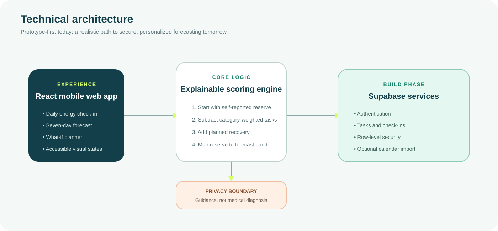

# EneryBuddy

> **Know your energy. Predict the storm. Prevent burnout.**

**Team:** `[TEAM NAME]` — `[MEMBER 1]`, `[MEMBER 2]`, `[MEMBER 3]`, `[MEMBER 4]`  
**Problem Statement:** Lifestyle Track — Beating the Burnout: Stress & Workload Manager  
**Interactive Prototype:** [EneryBuddy prototype](https://enerybuddy-prototype.apt-lake-7306.chatgpt.site)  
**Video Presentation:** `[ADD UNLISTED YOUTUBE LINK]`  
**Presentation Slides:** `[ADD PUBLIC SLIDES LINK IF USED]`

## 1. Project Overview

### The problem

University students rarely burn out because of one dramatic event. Deadlines, classes, paid work, commuting, errands and social commitments accumulate across different parts of life. Existing planning tools make time visible, but a free hour is not always a usable hour: a student can have space on a calendar and still lack the mental, physical or social energy needed for the next task.

This creates three gaps:

1. **Cumulative load stays invisible.** Commitments live across calendars, task lists and group chats.
2. **Planning is time-first, not capacity-first.** Students see when work happens but not its likely energy cost.
3. **Recovery is reactive.** Most interventions begin after missed work, poor sleep or withdrawal has already appeared.

The main stakeholders are students balancing study with work and personal responsibilities, followed by friends, lecturers, student-support teams and employers who are affected when overload becomes a crisis.

### Existing solutions and the gap

| Product | What it does well | Gap EneryBuddy addresses |
|---|---|---|
| [Todoist](https://www.todoist.com/help/todoist/features/use-the-calendar-layout-in-todoist-lPHRQTu0o) | Organises tasks, durations and calendar schedules | Primarily visualises **when** work occurs; it does not model separate mental, physical and social reserves or forecast a personal energy crash. |
| [Finch](https://help.finchcare.com/hc/en-us/articles/42149821015693-New-User-Guide) | Encourages self-care goals through a supportive companion | Supports recovery habits, but does not explain how a student's upcoming academic and work commitments combine into a high-risk day. |
| Standard calendar apps | Make events and free time visible | Treat every open hour as equivalent and leave the user to judge capacity manually. |

### Our solution

**EneryBuddy** is a mobile-first workload companion that represents a student's mental, physical and social capacity as three energy batteries. It converts projected energy reserves into an intuitive seven-day weather forecast, highlighting overload before it becomes a crisis. When a storm is detected, a What-If planner explains the cause and lets the student split, move or recover around tasks while preserving essential commitments. The forecast is an explainable workload-risk estimate—not a medical diagnosis.

### Core feature set

- **Three Batteries:** separate mental, physical and social reserves prevent “tired” from becoming one vague score.
- **Energy Weather:** Clear, Cloudy, Heavy and Storm conditions make a complex week understandable at a glance.
- **Seven-Day Forecast:** projects the effect of tasks and recovery before the student commits to the plan.
- **What-If Planner:** previews the impact of splitting, moving or shortening flexible commitments.
- **Explainable Warnings:** shows which commitments created the risk instead of outputting a mysterious score.
- **15-Second Check-In:** lightweight self-reporting keeps the forecast personal without demanding journaling.
- **Safety Boundary:** signposts university or trusted-person support when persistent strain is reported.

## 2. Ideation & Process

### 2.1 Ideas we considered

| Idea | Decision | Why it was dropped or kept |
|---|---|---|
| **Energy Battery** | **Chosen** | Makes invisible capacity tangible and recognises that mental, physical and social demands feel different. Weak alone because it only describes the present. |
| **Burnout Weather Forecast** | **Chosen** | Gives an immediate seven-day warning. Weak alone because a forecast without causes or actions can feel fatalistic. |
| **What-If Planner** | **Chosen refinement** | Turns awareness into action: students can test schedule changes and see a before/after result. |
| Minimum Viable Day | Future mode | Strong for critical days, but expands the prototype beyond the core prevention journey. |
| Guilt-Free Task Negotiator | Future feature | Useful for drafting extension or rescheduling messages, but introduces external communication and tone risks. |
| Burnout Buddy | Dropped | Peer support is valuable, but privacy, social pressure and safeguarding complicate an early prototype. |
| Stress Receipt | Future insight | Helpful for reflection, but weekly reporting acts after the load has already happened. |
| Recovery Menu | Integrated | Kept as contextual recommendations inside What-If rather than as a separate product area. |

### 2.2 How the idea evolved

| Iteration | Concept | What we learned | Change made |
|---|---|---|---|
| 1 | Stress tracker + task list | Logging stress reports the problem but can become another chore. | Reduced input to one 15-second energy check-in. |
| 2 | Energy Battery | A battery communicates capacity, but a single percentage hides the source of fatigue. | Split capacity into mental, physical and social batteries. |
| 3 | Burnout Weather | A weekly forecast creates early warning, but students still need agency. | Added an explanation panel and What-If planner. |
| 4 | EneryBuddy | Combining batteries and weather is memorable, actionable and feasible. | Scoped the prototype to one complete before/after journey. |

### 2.3 Ideation boards

#### Mindmap


This map connects the underlying causes and observable signals of overload to interventions and intended outcomes. It captures the central insight that students experience workload as energy, not only time.

#### Problem tree


The tree separates visible consequences from root causes. EneryBuddy acts on fragmented planning, time-only tools and reactive recovery before they produce a crisis.

#### Core user flow


The chosen flow moves from a low-effort signal to an explained warning, a controllable intervention and a measurable improvement.

### 2.4 Mentor consultation

> **Team action required:** Replace the row below with genuine feedback after speaking to a mentor. Do not invent feedback; include the date, the exact suggestion, and whether or how the concept changed.

| Date | Mentor | Feedback received | What was changed |
|---|---|---|---|
| `[DATE]` | `[MENTOR NAME]` | `[SPECIFIC FEEDBACK]` | `[CHANGE MADE, OR WHY THE TEAM DISAGREED]` |

Useful questions for the consultation:

- Is the battery-plus-weather metaphor immediately understandable?
- Does What-If Mode feel helpful or controlling?
- Is the prototype scope realistic for the build phase?
- Which claim needs stronger evidence or safer wording?

## 3. Design & Prototype

**UI Prototype:** [Open the interactive EneryBuddy prototype](https://enerybuddy-prototype.apt-lake-7306.chatgpt.site)

### Core flow covered

1. **Today:** understand current weather, the three batteries and today's energy costs.
2. **Forecast:** identify Thursday's storm and see why demand exceeds projected reserve.
3. **What-If:** compare the current and balanced schedules side by side.
4. **Apply:** raise Thursday's projected reserve from 7% to 31% without removing an essential commitment.

### Key screens

| Today and three batteries | Seven-day forecast |
|---|---|
|  |  |

| What-If comparison | Balanced plan applied |
|---|---|
|  |  |

### Design decisions

- Deep teal conveys trust without using clinical hospital styling.
- Lime marks agency and recovery; coral identifies risk.
- Icons, labels and percentages accompany colour for accessibility.
- Main body copy remains at least 16px in the mobile experience where practical.
- Controls have visible focus states and descriptive labels.
- The interface remains functional from 320px mobile width to desktop.

## 4. What Makes It Different

### A calendar for energy, not only time

Conventional planning asks whether a task fits into an hour. EneryBuddy asks whether it fits into the student's projected capacity at that time.

### Three-dimensional fatigue

A single wellness score can hide the reason a student is struggling. EneryBuddy separates mental, physical and social energy, so a recovery suggestion can match the depleted category.

### Weather as an early-warning language

Forecasts are familiar, glanceable and naturally future-oriented. “Thursday is stormy” communicates urgency without presenting the student as failing.

### An actionable forecast

The What-If planner is the defining twist. It does not merely report overload: it demonstrates the impact of splitting deep work, moving a flexible task and protecting recovery before the student applies the changes.

### Explainability over black-box AI

Every warning traces back to visible inputs—starting reserve, task demands and recovery. Students can disagree with estimates and adjust them. This builds trust and keeps the MVP technically realistic.

## 5. Technical Architecture & Feasibility



### Technology stack

| Layer | Technology | Why it fits | Constraint and response |
|---|---|---|---|
| Frontend | React 19, TypeScript, Vinext | Fast responsive prototyping with reusable accessible components | Prototype is currently web-first; package as a PWA or move shared logic into React Native later. |
| Interface | Tailwind CSS, Base UI, Lucide icons | Consistent visual system and keyboard-accessible primitives | Test colour contrast and screen-reader wording with real users. |
| Prototype state | React state | Makes the demo deterministic, fast and deployable without accounts | Data resets on refresh; persistence belongs in the build phase. |
| Build-phase backend | Supabase | Free-tier authentication and Postgres fit a student project | Apply row-level security and collect only data needed for forecasting. |
| Hosting | Cloudflare-compatible Sites deployment | Provides a shareable demo with a reproducible build | Keep server work within edge-runtime limits. |

### Explainable forecast model

The MVP deliberately uses a transparent weighted model instead of claiming medical prediction:

```text
starting reserve = weighted daily check-in + previous-day recovery
category demand  = sum(task intensity × duration × category weight)
projected reserve = clamp(starting reserve − demand + planned recovery, 0, 100)
```

Forecast bands:

- **Clear:** 65–100% reserve
- **Cloudy:** 30–64%
- **Heavy:** 15–29%
- **Storm:** below 15%

Weights begin with conservative defaults and can later adapt from the student's “estimated vs actual” feedback. The score measures workload strain only and must not be described as detecting or diagnosing a medical condition.

### Build plan and scope

| Priority | Build-phase deliverable | Definition of done |
|---|---|---|
| P0 | Daily check-in | A student can record mental, physical and social reserve in under 30 seconds. |
| P0 | Tasks with energy cost | Students can add, categorise and estimate a commitment. |
| P0 | Seven-day forecast | Each day displays a reserve, weather band and explainable cause. |
| P0 | What-If planner | Moving, splitting or adding recovery recalculates the forecast before saving. |
| P1 | Persistence | Authenticated users can securely save and retrieve their own plans. |
| P1 | Notifications | One useful warning appears before a projected storm, with opt-out controls. |
| P2 | Calendar import | Read-only import reduces duplicate entry after the core loop is validated. |
| Out of scope | Wearables, medical diagnosis, counsellor dashboards, automatic messages | These add privacy, clinical or integration risk before the core value is proven. |

### Resource and time awareness

- **Frontend/design:** one member can implement the three-screen journey and responsive states.
- **Logic/data:** one member can own the scoring model, seed scenarios and later persistence.
- **Research/testing:** one member can run five short student usability tests and document mentor feedback.
- **Pitch/documentation:** one member can maintain this README, rehearse the demo and verify every public link.
- **Cost:** the prototype uses free/open-source libraries and can be demonstrated without paid APIs.

## 6. Impact

### Primary user

EneryBuddy first serves a university student who balances multiple modules with paid work, commuting and social commitments. This audience needs early visibility and permission to rebalance—not another streak, productivity score or generic reminder to “relax.”

### Before and after

| Before EneryBuddy | After EneryBuddy |
|---|---|
| An open calendar slot looks usable even after an exhausting day. | The slot is interpreted against mental, physical and social reserve. |
| Overload becomes obvious only after sleep or work deteriorates. | A Storm warning appears several days earlier. |
| The student knows something is wrong but not what caused it. | The warning names the commitments and missing recovery that created the risk. |
| Rest feels like falling behind. | What-If Mode shows that targeted recovery can preserve essential work. |

### Prototype impact scenario

A student begins Thursday with 61% energy but faces 85% demand from a lab, assignment, revision block and paid shift. Their original plan ends at a 7% reserve. EneryBuddy splits the assignment, protects lunch and moves one flexible revision block; the revised plan ends at 31%. That **+24 percentage-point safety margin** is the clear before/after moment demonstrated in the prototype.

### Reach and scalability

The same model can expand from individual students to opt-in university wellbeing programmes without exposing private task details. Longer term, configurable energy categories can serve interns, shift workers and caregivers. Scaling should follow user validation and privacy review, not precede them.

## 7. Run Locally

Requirements: Node.js 22.13 or newer.

```bash
npm install
npm run dev
```

Then open `http://localhost:3000`.

For a production build:

```bash
npm run build
```

## 8. Responsible Use

EneryBuddy is a workload-awareness prototype. It does not diagnose, treat or prevent a medical condition, and its forecast should never replace professional care. A production version would minimise data collection, keep task details private by default, allow full data deletion and direct students to appropriate campus or emergency support when needed.

## Submission checklist

- [ ] Replace team placeholders at the top of this README.
- [ ] Add genuine mentor feedback and the resulting change.
- [x] Add 4–8 final screenshots under Section 3.
- [ ] Verify the prototype and all design links in an incognito window.
- [ ] Record a 3–5 minute video using `VIDEO-SCRIPT.md`.
- [ ] Upload the video as Unlisted and replace the link above.
- [ ] Make the final GitHub repository public.
- [ ] Test the public repository and YouTube links while signed out.
